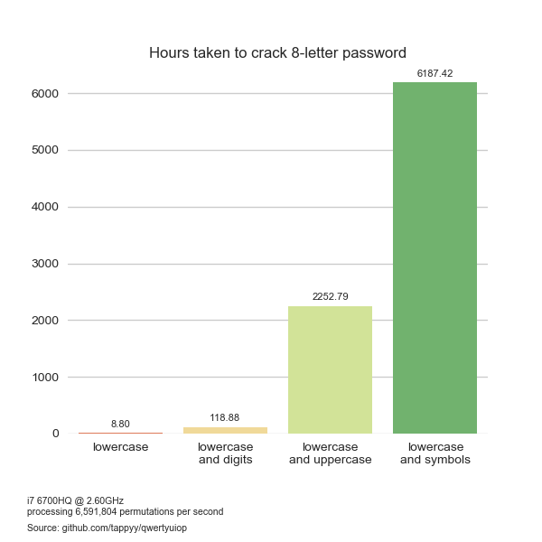

# qwertyuiop
#### An adventure into password cracking on the CPU with Python

### To-do
- Multi-threading to speed up benchmark test
- Add option to perform benchmark on GPU

## Overview
Find the approximate crack time of a password by performing a brute force attack and outputting the results to a .csv file for visualisation.

##### Step 1 - Get guess rate of CPU
Perform a brute force attack on a randomly generated 10-character password. Once the benchmark guess limit has been reached, a guesses per second rate is calculated.

##### Step 2 - Calculate total permutations
Sample space is calculated based on characters contained in the password.

- alphabet lowercase (a-z) = 26
- alphabet uppercase (A-Z) = 26
- numerics (0-9) = 10
- non-alphanumerics (!?£$%^ etc) = 33

**Example:**

`g!thu8` contains characters from lowercase, numerics and non-alphanumerics.

sample space = 26 + 10 + 33 = 69

permutations = sample space ^ length of password = 69^6

permutations = 107918163081

##### Step 3 - Calculate approximate crack time
Using the guess rate per second and total number of permutations, the crack time is calculated.

crack time = permutations / guess rate = 107918163081 / 6552832

crack time = 16468.93 seconds *or* 274.48 minutes *or* 4.57 hours.

##### Step 4 - Output results
Once all passwords in the file have been analysed, a .csv file is created containing the following information:

- Password
- Crack time (hours)
- Crack time (days)
- Permutations in short form *Eg. 69^6*

## Requirements
[Seaborn](http://seaborn.pydata.org/index.html) - Used for data visualisation

Install Seaborn and its dependencies with the following command:

``` 
pip install seaborn
```


## Usage
Recommended usage is as follows:
```
python qwertyuiop.py -i file.txt -o results.csv 
```
`-i` - .txt file containing a list of passwords to analyse. **(required)**

`-o` - .csv file to output the results to.

`-b` - Perform a new benchmark test to determine an accurate guess rate. - *(optional)* 

`-h` - For when you get stuck :)

**Note:** For the best results, perform a benchmark with as few processes running as possible.

## Examples



## Thanks
Thanks to [ScottSmudger](https://github.com/ScottSmudger) for the regex help!

Inspired by https://github.com/dwolfhub/zxcvbn-python
